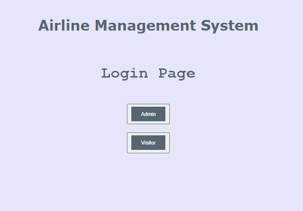
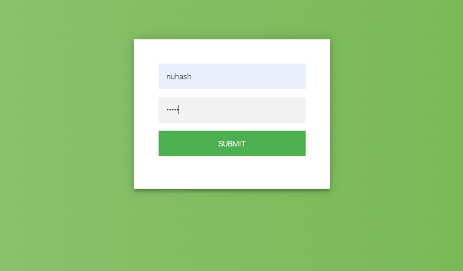
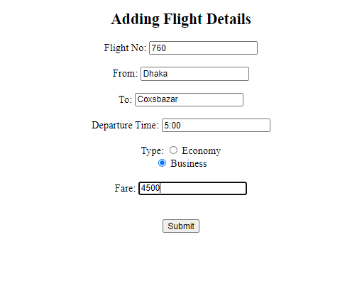
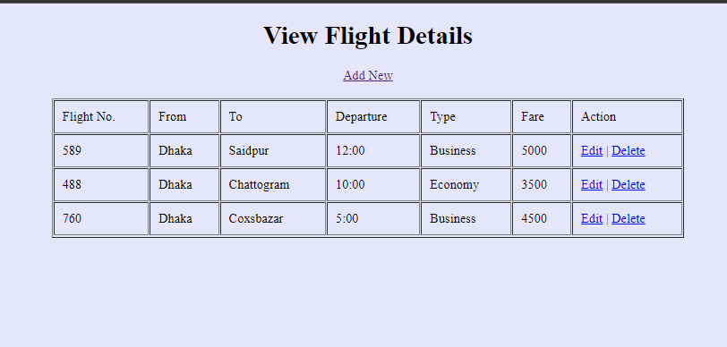
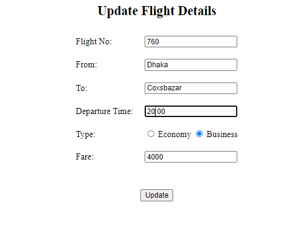
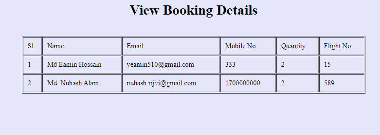
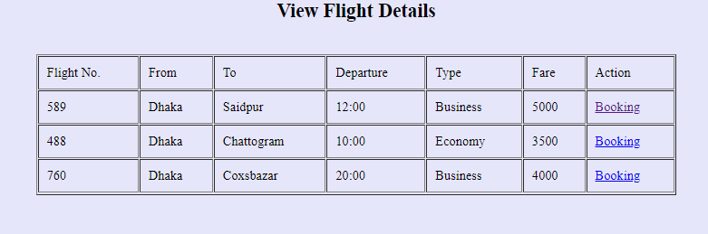
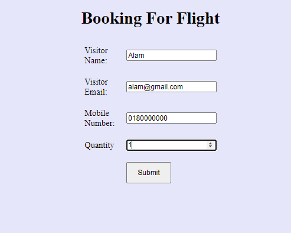

Airline Management System using PHP and MySQL

This project Airline Management System has been developed on PHP and MySQL. The main purpose for developing this project can helps admin to manage the airline flight details and user to book for the flights. This application is very simple and easy to access. 
Modules and Description of Airline Management System Project:
Functionality of the Airline Management System:
These are the functionality performed by the project:

1. Login For Admin
2. Dashboard for Admin
3. Dashboard for User

Flight Module:
This module provides all the functionality related to flights. It tracks all the information and details of the flights. Admin can do all the CRUD (Create, Read, Update and Delete) operations of the flights. 

1. Admin can add new flights records
2. Admin can see the list of flights details
3. Only admin can edit and update the record of the flights
4. Admin will be able to delete the records of the flights

View Flight Booking Module:
This module provides all the functionality related to booking of the flights. It shows all the information and details of the booking person. 

1. Admin can add see the booking flight details
2. Admin can see the booking person information

Booking Module:
This module provides all the functionality related to booking. It shows all the information and details of the flights and gives the access for booking of it. After providing the personal information and quantity, the user can book for the flights.

1. User can see the list of flights details
2. User can book for the flights.

Technology used for this project:

1. HTML: Page layout has been designed in HTML
2. CSS: CSS has been used for all the designing part
3. PHP: All the frontend logic has been implemented in PHP that makes dynamic and interactive webpage.
4. MySQL : MySQL database has been used as database for the project

Supported Operating Systems:
We can configure this project on following operating system.

1. Windows: This project can easily be configured on windows operating system. For running this project on Windows system, you will have to install WAMP or XAMP on your system.
2. Linux: We can run this project also on all versions of Linux operating system. You will have to install WAMP or XAMP on your system.

Project Made By
Md. Nuhash Alam,
Email: nuhash.rijvi@gmail.com 

